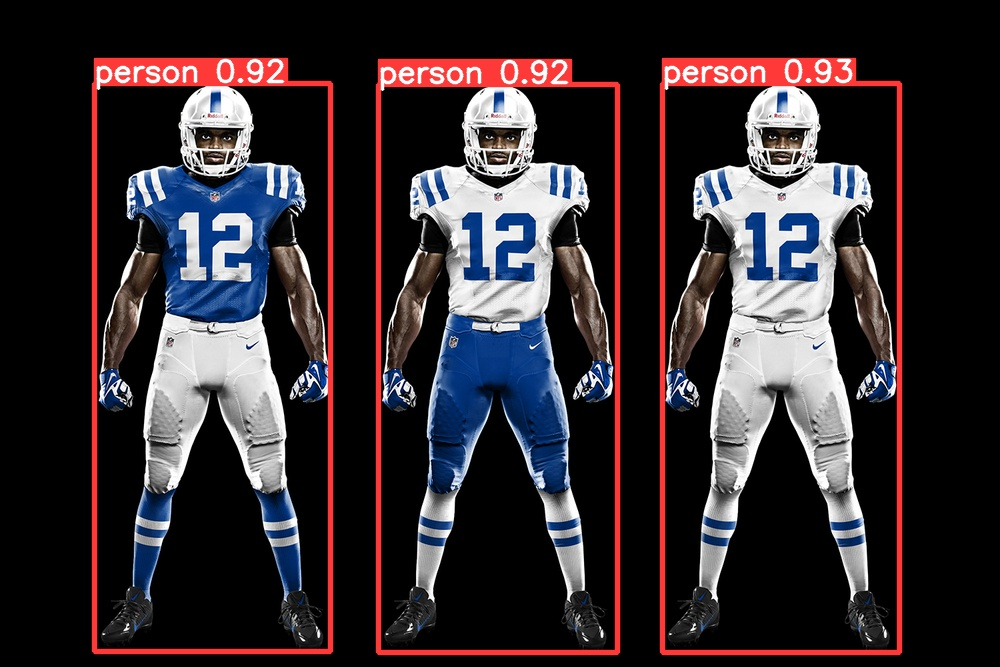

# Jersey-number-detection
In this project i tried to build a Ai where based on specific Jersey color player will be detected and also jersey-number detected for that player only
Project Agenda
  - first i train the EasyOcr recognation model with opensource Roboflow dataset
  - for EasyOcr training i used sagemaker Studiolab for Gpu , currently what i provied in [Ocr_training.ipynb](./main/Ocr_training.ipynb) file that same code i run in sagemaker Studilab Gpu evn
  - then i prdicted the player as a person with the help of Yolov8 pretrained "s" model as you can see in (fig-1) 
  - after detection i have done colour classification with the opencv and calculate the pixel value for blue and white colour
  - then i made a condition that satisfied if the white colour pixel value more then blue colour pixel value then only draw the box and detecte the jersey number for that player only, as you can see in (fig-2) 
  - for my custom train EasyOcr model i used only jersey number data set and i did not train any text detection model or Easyocr craft model, but for real time applycation we can train our won text detection model or we can      tain EasyOcr Craft model
  - Also i want to add one thing for player detection we can used Transfer learning with Yolov8 or any available pretrained CNN model with pytorch and tenseflow, in feature i will do the project based on this with new            problem statment 
